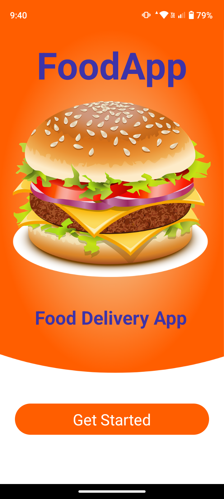
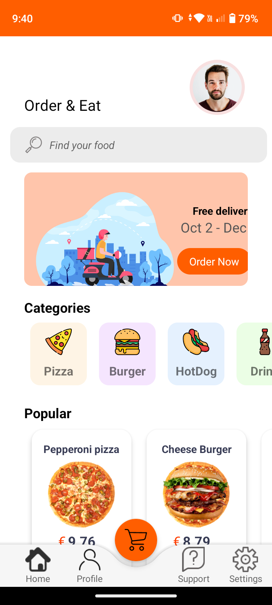
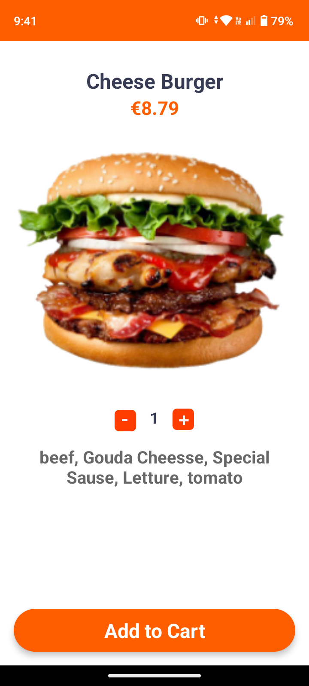
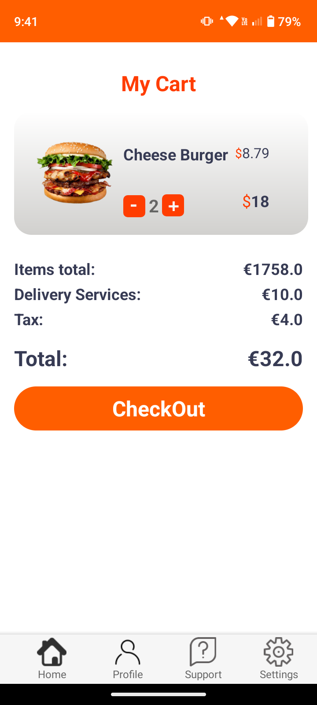

# 😜Food App UI 🍔

## Overview

The following app is about the implementation of the basic UI of an app that has to do with food.
The app does not have any implemented logic, only the UI has been developed.

In the app, we use the tiny database to store some data about the cart of the user
just to show off the View that has to do with the cart the user created by choosing
some food to order.

The code has been done using <b>Java</b> 💖. And the IDE that we use is Android Studio 👨‍💻 

In the following pics you can see the Views the app has at this moment.

## 📲 Run the app 📱

To run the app the only thing you have to do is to have in your desktop an emulator
installed (of course you can use the emulator of Android Studio). You just have to 
go in the location of the source code './APK' and run the apk file you see there using the 
emulator of you choice.

################################################################################################
################################################################################################
################################################################################################